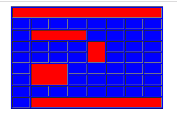
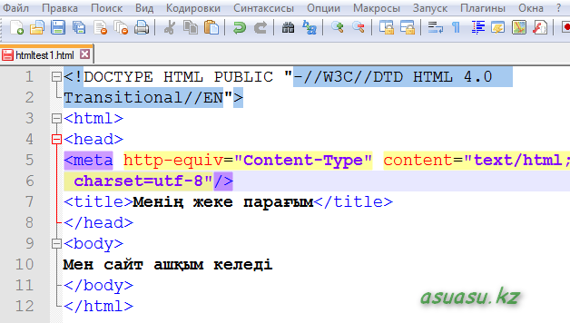

# byrynshy tapsyrma
## sýret

>
## barysy
>>
### HTML tuıyn sozden paıdalanyp keste jasaý
>

## jalǵanym

> [keste](file:///C:/Users/Toqtabai/Desktop/New%20folder/1-tapcrma.html)
>
---
##  tusynykteme

> **jalpy tusynykteme*** Sonymen, HTML degen ne? HTML tegi neni bildiredi.

Men bul maqalamda HTML degennin' ne ekendigine toqtalyp qana qoi'mai', HTML din' u'i'reny'ge qans'alyqty jen'il til ekendigine oqyrmandardyn' ko'zderin jetkizgim keledi.Sebebi, bul tildi u'i'reny' arqyly siz  qalai' sai't jasalatynyn  sa'l de bolsa ug'yna alasyz.

HTML degenimiz-  ag'yls'yns'a HyperTextMarkupLanguage, i'ag'ni' gi'perteksti tan'balay' tili degendi bildiredi.Osy til arqyly sai'ttyn' paraqtary jazylady.

Ony en' birins'i bolyp as'yp, a'lemge pas' etken i'nternettin' atasy Ti'm Berners-Li' degen azamat.Ol mundai' tildi as'y' u's'in sol kezde qoldanysta ju'rgen SGML degen tildi pai'dalang'an.|
---
##  HTML qurylsy
## sýret

